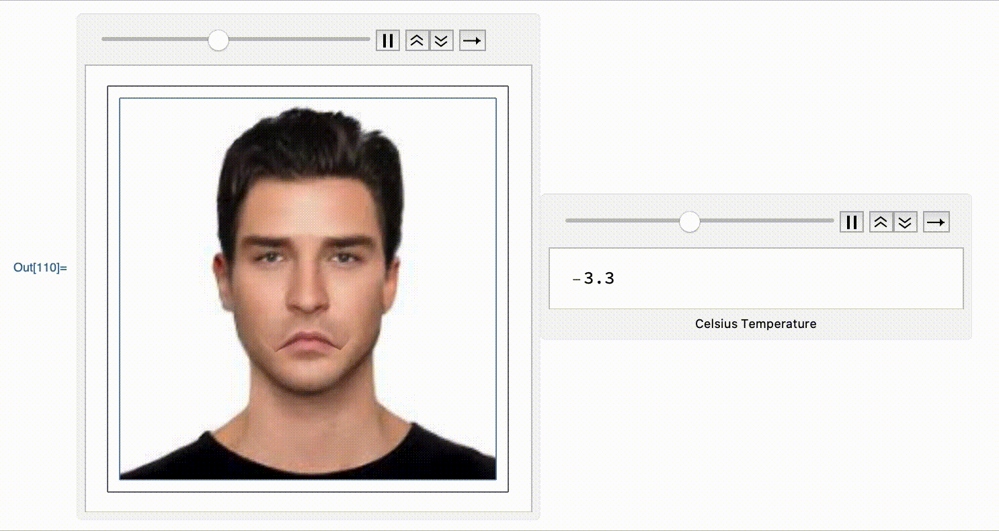

# Chernoff Faces
Final Project (Part of Image Processing (CS533) Course at UW-Madison)

Chernoff faces, invented by Herman Chernoff in 1973, display multivariate data in the shape of a human face.  It is a simple sketch of a human face that is parameterized by a few variables. By manipulating the variables, it is possible to achieve a wide range of expressions. The aim of this project is to simulate Chernoff Faces on real world images. We can manipulate the variables to change the expressions of the subject and simulate anger, surprise, sadness and happiness.

This project contains a Mathematica notebook, which contains sample code for a toy chernoff face, provided by our professor, Bill Sethares at University of Wisconsin - Madison. This was achieved by using FacialFeatures method in Mathematica to obtain points in the image for various facial features and then using interpolation to manipulate these features according to given input. The facial feature were then redrawn using a BSplineFunction for mapping colors from image and ParametricPlot to finally plot it.

1. First part of the project involves manipulating real world images to change the emotions of the subject.
2. In second part of the project, we animated the emotions based on climate data (temperature for Chicago from 1 Jan, 2017 to 3 Jan, 2017 in Degree Celsius. One can observe that animated face is changing (becoming sad/neutral/happy) in response to the data.

# Sample Outputs [Happy and Sad expressions generated from input image (left)]

# Animated Outputs for a person (psst he doesn't like cold weather) [based on temperature data for Chicago ]

